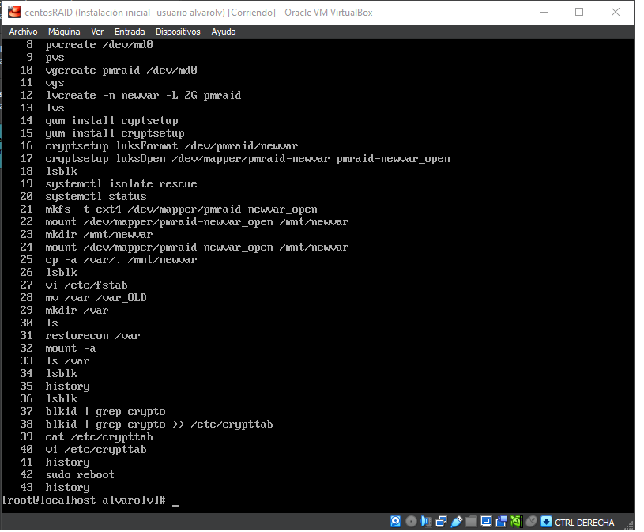
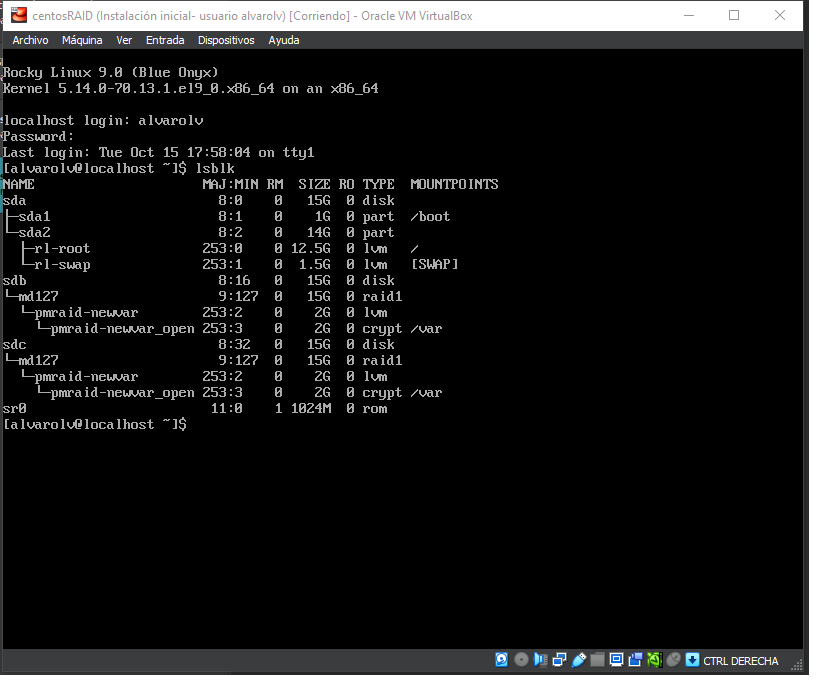
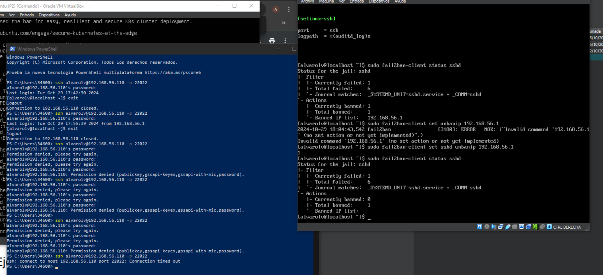

# practicasISE

Repositorio de las prácticas de la asignatura ISE.

## Contenidos

Este repositorio contiene las imágenes y archivos correspondientes a las prácticas realizadas en la asignatura ISE. A continuación, se detalla cada práctica con su respectiva imagen.

---

### Práctica 1 : Virtualización e instalación de Sistemas Operativos

#### Lección 0
[Historial de la práctica 1 - Lección 0](history-P0-L1.txt)

#### Lección 2

#### Lección 3
- Imagen 1  
  

- Imagen 2  
  

---

### Práctica 2 : Instalación y configuración de servicios

#### Lección 1

#### Lección 2

